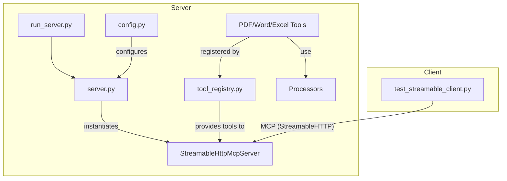

# 架构设计文档

本文档描述 `any2markdown` 项目重构后的技术选型、项目结构和核心架构。

## 1. 技术选型

| 组件 | 技术 | 理由 |
| --- | --- | --- |
| **核心协议** | `MCP (Model Context Protocol)` | 遵循官方标准，确保与 MCP 生态系统的兼容性和互操作性。 |
| **Python SDK** | `mcp-client-python` | 使用官方提供的 Python SDK，以获得最佳支持和稳定性。 |
| **Server 实现** | `StreamableHttpMcpServer` | 根据用户要求，实现支持流式响应的 HTTP 服务器，适用于可能的大型文件处理和长时任务。 |
| **Client 实现** | `StreamableHttpMcpClient` | 与服务端协议匹配，用于开发测试和验证工具。 |
| **异步框架** | `asyncio` | Python 原生异步框架，与 `mcp-client-python` 良好集成，提供高性能 I/O。 |
| **依赖管理** | `requirements.txt` / `pyproject.toml` | 沿用项目现有依赖管理方式。需要将 `mcp-client-python` 添加为新的依赖。 |

## 2. 项目目录结构 (重构后)

重构将主要修改现有文件，并新增一个测试客户端。

```plaintext
any2markdown/
├── docs/
│   └── mcp-refactoring-plan/  # 本次重构的规划文档
│       ├── requirements.md
│       ├── architecture.md
│       ├── api-design.md
│       ├── ui-spec.md
│       └── todo-list.md
├── src/
│   └── any2markdown_mcp/
│       ├── server.py           # 【重点修改】将重构为 StreamableHttpMcpServer
│       ├── tools/
│       │   ├── tool_registry.py # 【重点修改】调整工具注册逻辑以适应新 Server
│       │   ├── ...             # (工具定义文件基本不变)
│       ├── config.py           # (基本不变)
│       └── ...                 # (其他核心逻辑不变)
├── run_server.py               # 【重点修改】更新服务器启动脚本
├── test_streamable_client.py   # 【新增】用于验证新 Server 的官方 SDK 客户端
└── requirements.txt            # 【需修改】添加 mcp-client-python 依赖
```

## 3. 核心架构设计

### 3.1. MCP Server (`server.py`)

1.  **服务器实例化**:
    *   `server.py` 的核心将不再是手动的 `aiohttp` web app，而是 `StreamableHttpMcpServer` 的一个实例。
    *   服务器的初始化将从 `config.py` 读取主机（host）和端口（port）配置。

2.  **工具注册**:
    *   我们将创建一个 `ToolRegistry` 类或模块 (`tool_registry.py`)，负责发现和收集所有 `BaseTool` 的子类。
    *   `ToolRegistry` 会将收集到的工具实例列表提供给 `StreamableHttpMcpServer` 的构造函数。
    *   服务器启动时，它会自动为所有注册的工具生成符合 MCP 规范的端点（如 `POST /tool/convert_pdf_to_markdown`）。

3.  **请求处理流程**:
    *   客户端通过 `StreamableHttpMcpClient` 发送工具调用请求。
    *   `StreamableHttpMcpServer` 接收请求，解析其 payload。
    *   根据请求的工具名称，服务器分派任务给对应的工具实例。
    *   工具的 `execute` 方法（异步）被调用，执行核心业务逻辑（如调用 `pdf_processor`）。
    *   执行结果被封装成 MCP 响应格式，通过 `StreamableHTTP` 返回给客户端。对于大文件，可以设计成分块/流式返回。

### 3.2. MCP Client (`test_streamable_client.py`)

1.  **客户端实例化**:
    *   客户端将实例化 `StreamableHttpMcpClient`，并传入服务器的地址（例如 `http://127.0.0.1:8080`）。

2.  **工具调用**:
    *   客户端将使用 `client.tools.{tool_name}.call()` 的方式来调用服务器上的工具。
    *   例如: `await client.tools.convert_pdf_to_markdown.call(file_path="path/to/file.pdf")`。
    *   这种方式利用了 SDK 的便利性，将函数调用无缝转换为对远端 MCP Server 的 API 请求。

3.  **结果处理**:
    *   客户端接收从服务器返回的响应。由于是流式协议，可以使用 `async for` 循环来处理可能的多部分响应。
    *   对于简单的请求-响应模式，直接 `await` 调用即可获得最终结果。
    *   测试客户端将打印或验证返回结果的正确性。

### 3.3. 依赖关系图

