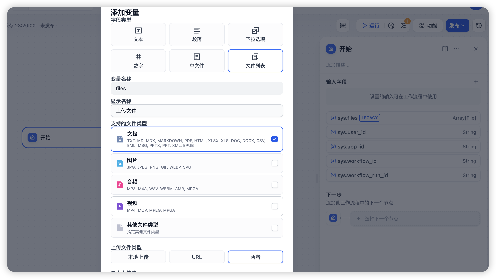
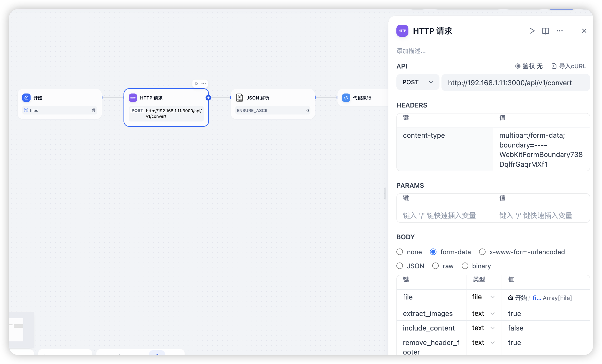
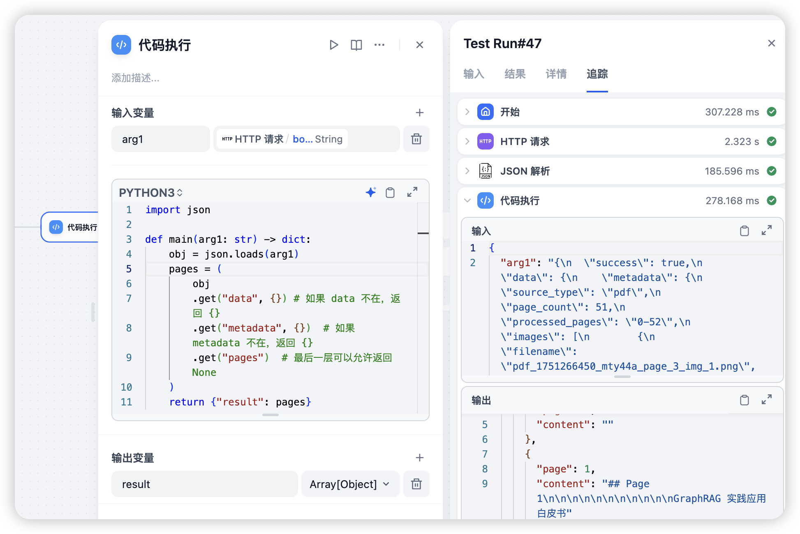

# dify 集成any2markdown

**示例DSL**：导入 [dify-workflow-dsl.yml](./dify-workflow-dsl.yml) 到dify中，可以参考使用。

1. 添加文件上传变量

   在工作流（或chatflow）的「开始」节点添加文件上传变量，支持文档上传，如下图：



2. 「Http请求」节点

   在流程中添加「Http请求」节点，，使用post方式请求api，具体参数参考[restful-api-design](./restful-api-design.md#311-文件上传方式-multipartform-data)

   重要参数列表：

   - Headers:
     - content-type: multipart/form-data; boundary=----WebKitFormBoundary738DqlfrGaqrMXf1
   - Body.form-data:
     - file: <变量形式，从开始节点获取文件列表>
     - 其他均为可选参数




3. 结果处理

   有几种种方式：

   - 1. 使用工具节点「JSON解析」，直接获取处理后的结果
   - 2. 使用「模板转换」节点，基于Jinja2完成结果处理和使用
   - 3. 使用「代码执行」节点，基于Python完成结果处理和使用，比如可以转换为数组输出，然后通过「迭代」节点，进行更复杂的处理，避免一次性给大模型输入太长内容导致无法准确处理，示例获取分页markdown如下,几个转换为数组输出供迭代使用：
```python
import json

def main(arg1: str) -> dict:
    obj = json.loads(arg1)
    pages = (
        obj
        .get("data", {}) # 如果 data 不在，返回 {}
        .get("metadata", {})  # 如果 metadata 不在，返回 {}
        .get("pages")  # 最后一层可以允许返回 None
    )
    return {"result": pages}
```


